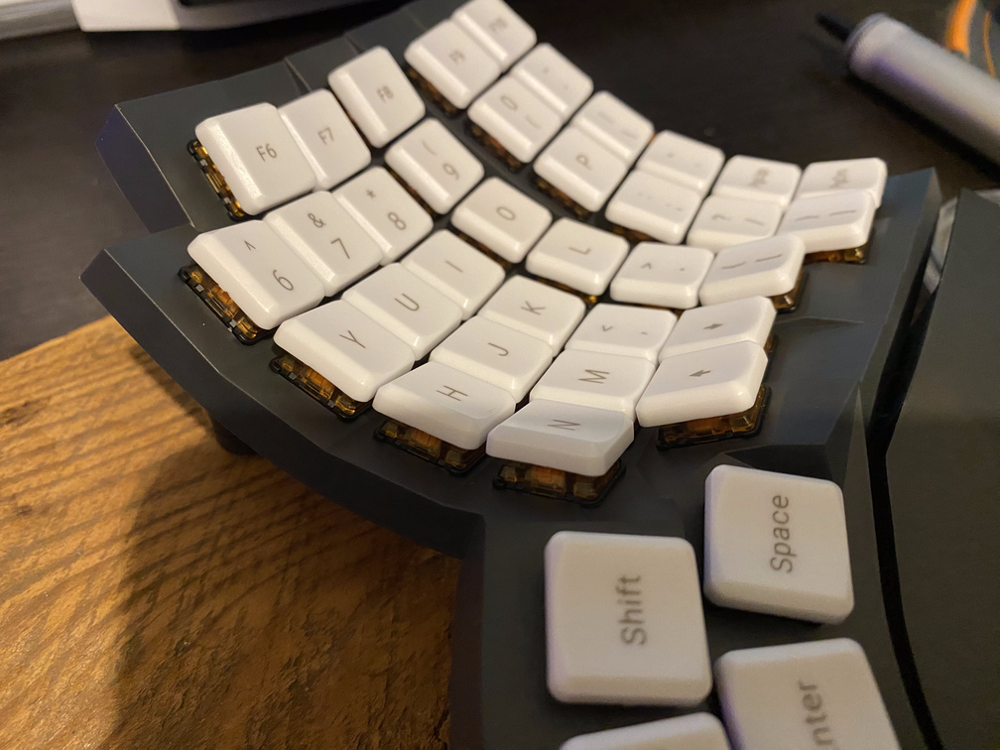

# Glove80 soldered or not soldered, that is the question

## Why would I like to solder the switches when there is already a soldered version ?
I've been looking for a while for the right keyboard for me.

After some tests and searches I found that the MoErgo Glove80 would be the best choice for me.

Then I had to chose between the switches flavors offered.

The proposed defaults are the usual linear, clicky, tactile choice which are fine, but I was wondering if I could get a better choice for me with more specific choc switches.

After some readings and tests, I felt for the sunset clicky switches which I prefered from the classic brown version.

But at that time I wasn't sure I would be able to get the unsoldered version of the glove80 and solder my sunrise switches without damaging the whole thing.

As long as I'm a true adventurer, I chose the risky unsoldered version of the keyboard (I read a bit before about the persons who also did that choice and seemed to get well with it)

## Receiving the keyboard and try not to mess with it
I received the keyboard last week (and was sooooo happy)
It took me 2 to 3 hours to get it up and ready with my new sunset switches soldered.
The keyboard arrives with default red linear switches in place, but they are not soldered.

They are different tasks you will have to do to get it up and running :
1. Unscrew the palm rests and take them away from the keyboard
2. Unscrew all the screws from the left and right parts
3. Carefully open the parts not to break the FCC cables
4. Open and pull off the FCC cables
5. Pull the keycaps off
6. Pull the switches off
7. Put the new switches on
8. Solder the switches
9. Put the FCC cables back in
10. Close the parts and screw it back
11. Put the keycaps back on
12. Enjoy !

But those steps are not that simple and a few precautions should be taken for them to be done in a good way.

### Unscrew the palm rests
Easy muffin, you can do it manually but if the screw is too tight you can use a screwdriver (I had to use it for two of the screws)

When it's done, it's easy to take the palm rests appart
### Unscrew all the screws from the left and right parts
This part is also a piece of cake as long as you can turn a screwdriver counterclockwise.

Just unscrew all the screws and don't open the keyboard part yet !
### Open the parts
Here you've got to be careful while pulling the two parts appart as long as they are linked with 4 FCC cables.

If you pull too hard you might damage them.

The right way to do it is to return the top part upside down without pulling on the FCC cables :

Then you can pull the adhesive tape and access the FCC connector.
You can see on the photo the two opened connectors on the right and two closed ones with cables on the left.
Just open it and pull the cable out.

Now you have the top shell which you want to work on appart :

### Pull the keycaps off
You will have to pull the keycaps with a keycap puller.

As long as the red original switches are not soldered, they might come with the keycap when you are trying to pull it.

It's not a problem at all, but you should pay attention to it for a good reason.

They are 4 distinct PCBs on the glove 80 which are bent to fit the curved shape of the keyboard. 

If you pull all the switches off, the PCB won't be well attached to the shell and it might pop out off the shell and unbend.

This is not a big problem as you can stil bend it and put back, but it's really a pain to put back so I encourage you to replace immediatly any switch that was pulled with a keycap to be sure you have no more than one switch pulled at a time and that the PCB will stay in place.

### Pull the switches off
Same as before, pull carefully the switches with a switch puller, one by one, and replaced them as you go !

You will want to maintain the PCB in place when pushing the new switch in not to pop out the PCB or damage it.

I'm a bad boy not doing them one by one...

### Solder the switches
One you have all your switches in place, the soldering is quite easy.

One tricky part is for the edge ones which are near the plastic parts that maintain the PCB in place.
These are the most on the botom on the photo.

As long as you will apply high temperature next to the plastic, it might melt a bit.

My advice for this is to try to go quickly for thoses pins not to apply too much heat.

Another tricky part is for the pins close to the FCC connectors. If they are far out from the PCB, they might scratch the FCC cable when it is in place.

You might want to clip them to avoid contact before soldering, or cut a bit with a plier before or after soldering.

When all the soldering is done, you're ready to put back all the pieces together.

### Put the FCC cables back in
Place the top shell upside down on the bottom shell so that the FCC cables can reach the connectors easily.

When it's in place just push gently the FCC cables in the connectors and close the connector.

### Close the parts and screw it back

Turn the upper shell on the botom one and place it to screw it back.

Screw all the screws.

Easy muffin putting back the palm rests.

### Put the keycaps back on

Now you can either test the keyboard if you want to be sure all is ok, or put back the keycaps first as long as you're confident with your work.

Enjoy your new keyboard with your prefered flavor switches !

