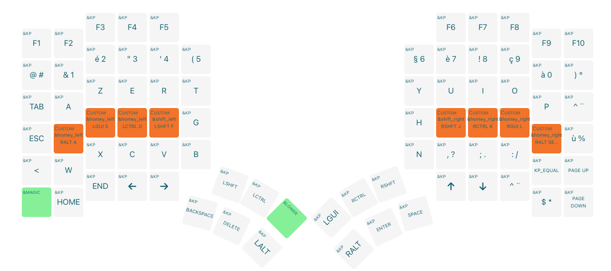
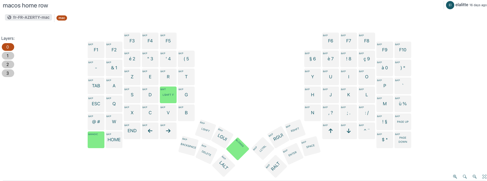
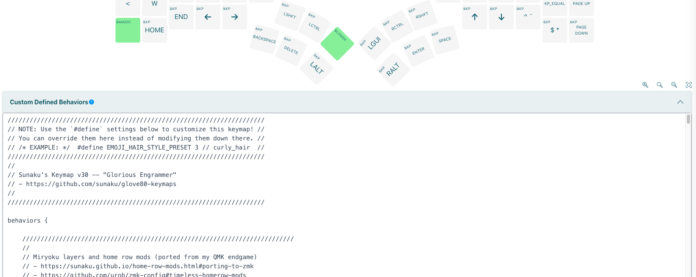
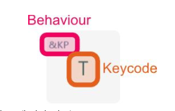
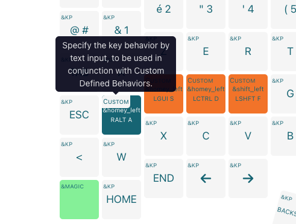
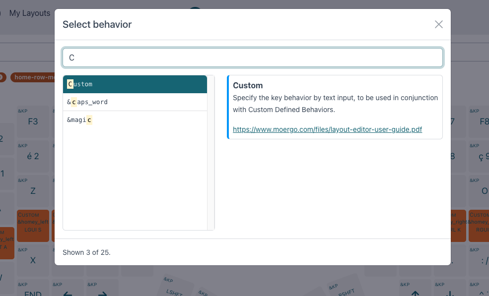

# Glove80, using Sunaku's home row mods from scratch

When I got my glove80, I knew I would want to try home row mods (HRM) with it, but I was wondering how to tweak it to adjust to my needs and typing style so I don't have too much unintended activations during typing.

# Finding information and the best solution
As long as I was looking for home row mods tips, I first found [this page](https://precondition.github.io/home-row-mods) from precondition which is a fantastic mine of information on the basics of home row mods. The only problem is that all the tweakings done are on QMK and not ZMQ as on glove80.

Then I tried [the ZMQ official doc]()https://zmk.dev/docs/behaviors/hold-tap which is quite nice, but it still seemed complex to me to find the sweet spot with all those possibilities.
I then found [Sunaku's page](https://sunaku.github.io/home-row-mods.html) which talks about HRM, but have a [special part dedicated to ZMQ](https://sunaku.github.io/home-row-mods.html#porting-to-zmk) as long as Sunaku is also using a glove80 for a while. He also adds very useful and valuable information about his journey with trying to find the sweet spot.

# Ok, But what to do then to get it on my favourite glove ?
When you are starting from zero with the glove80, it can be difficult for you to understand how everything works together and how to tweak your keyboard. 

This page is trying to show you step by step the right way to put HRM on any actual keymap configuration.

# First, put your prefered configuration on your keyboard
You can go on the web editor to find the right configuration for you. As long that I type on french azerty on MacOs, I had to find the right keymap setting on the interface, but this is well documented in [the official documentation](https://www.moergo.com/files/layout-editor-user-guide.pdf).

When all seems fine in your editor, you'll have to send the configuration to your glove80, but this is also well documented in the docs.



# Dealing with Sunaku's home row mods part
If you just want the HRM part of Sunaku, but not all the Miryoku's stuff along with it, you'll just have to follow these steps (which are detailed just after) :

1. Copy [the HRM part](https://sunaku.github.io/home-row-mods.html#snippet) of Sunaku's configuration,
2. Paste it in the "Custom defined behavior" part of your config,
3. Link the home row keys to the custom definitions of added configuration,
4. Build your new firmware,
5. Apply it to BOTH parts of your keyboard,
6. Enjoy typing with home row mod

# Detailed steps
## Copy the HRM part of Sunaku's configuration and paste it
As pointed before, Sunaku made a great job pointing to the HRM part of his full config. I put it here as well :

```
//////////////////////////////////////////////////////////////////////
// NOTE: Use the `#define` settings below to customize this keymap! //
// You can override them here instead of modifying them down there. //
// /* EXAMPLE: */  #define EMOJI_HAIR_STYLE_PRESET 3 // curly_hair  //
//////////////////////////////////////////////////////////////////////
//
// Sunaku's Keymap v30 -- "Glorious Engrammer"
// - https://github.com/sunaku/glove80-keymaps
//
//////////////////////////////////////////////////////////////////////

behaviors {

    //////////////////////////////////////////////////////////////////////////
    //
    // Miryoku layers and home row mods (ported from my QMK endgame)
    // - https://sunaku.github.io/home-row-mods.html#porting-to-zmk
    // - https://github.com/urob/zmk-config#timeless-homerow-mods
    //
    //////////////////////////////////////////////////////////////////////////

    //
    // HOMEY_HOLDING_TYPE defines the flavor of ZMK hold-tap behavior to use
    // for the pinky, ring, and middle fingers (which are assigned to Super,
    // Alt, and Ctrl respectively in the Miryoku system) on home row keys.
    //
    #ifndef HOMEY_HOLDING_TYPE
    #define HOMEY_HOLDING_TYPE "tap-preferred"
    #endif

    //
    // HOMEY_HOLDING_TIME defines how long you need to hold (milliseconds)
    // home row mod keys in order to send their modifiers to the computer
    // (i.e. "register" them) for mod-click mouse usage (e.g. Ctrl-Click).
    //
    #ifndef HOMEY_HOLDING_TIME
    #define HOMEY_HOLDING_TIME 270 // TAPPING_TERM + ALLOW_CROSSOVER_AFTER
    #endif

    //
    // HOMEY_STREAK_DECAY defines how long you need to wait (milliseconds)
    // after typing before you can use home row mods again.  It prevents
    // unintended activation of home row mods when you're actively typing.
    //
    #ifndef HOMEY_STREAK_DECAY
    #define HOMEY_STREAK_DECAY 170 // global-quick-tap-ms
    #endif

    //
    // HOMEY_REPEAT_DECAY defines how much time you have left (milliseconds)
    // after tapping a key to hold it again in order to make it auto-repeat.
    //
    #ifndef HOMEY_REPEAT_DECAY
    #define HOMEY_REPEAT_DECAY 300 // "tap then hold" for key auto-repeat
    #endif

    //
    // SHIFT_HOLDING_TYPE defines the flavor of ZMK hold-tap behavior to use
    // for index fingers (which Miryoku assigns to Shift) on home row keys.
    //
    // NOTE: The "tap-preferred" flavor of ZMK hold-tap for index finger keys
    // allows faster activation of the Shift modifier (without having to wait
    // for the modified key to be released as the "balanced" flavor requires).
    // Typing streaks and the `hold-trigger-on-release` setting are disabled
    // for the index fingers so as not to hinder their speed and dexterity.
    //
    #ifndef SHIFT_HOLDING_TYPE
    #define SHIFT_HOLDING_TYPE "tap-preferred"
    #endif

    //
    // SHIFT_HOLDING_TIME defines how long you need to hold (milliseconds)
    // index finger keys in order to send their modifiers to the computer
    // (i.e. "register" them) for mod-click mouse usage (e.g. Shift-Click).
    //
    // CAUTION: You'll need to perform inward rolls from pinky->ring->middle
    // fingers toward the index fingers when activating multiple modifiers
    // because `hold-trigger-on-release` is disabled for the index fingers.
    // Otherwise, you may be surprised that the index fingers' modifier is
    // sent immediately without the rest of your multi-mod chord when you
    // perform outward rolls from your index fingers toward your pinkies.
    //
    #ifndef SHIFT_HOLDING_TIME
    #define SHIFT_HOLDING_TIME 170
    #endif

    //
    // SHIFT_STREAK_DECAY defines how long you need to wait (milliseconds)
    // after typing before you can use home row mods again.  It prevents
    // unintended activation of home row mods when you're actively typing.
    //
    #ifndef SHIFT_STREAK_DECAY
    #define SHIFT_STREAK_DECAY 70 // global-quick-tap-ms
    #endif

    //
    // SHIFT_REPEAT_DECAY defines how much time you have left (milliseconds)
    // after tapping a key to hold it again in order to make it auto-repeat.
    //
    #ifndef SHIFT_REPEAT_DECAY
    #define SHIFT_REPEAT_DECAY 300 // "tap then hold" for key auto-repeat
    #endif

    //
    // THUMB_HOLDING_TYPE defines the flavor of ZMK hold-tap behavior to use
    // for the thumbs (which are assigned to 6 layers in the Miryoku system).
    //
    // NOTE: The "balanced" flavor of ZMK hold-tap provides instant modifier
    // activation for the symbol layer (if the tapped symbol key is released
    // while the thumb layer key is still held down) for quicker programming.
    //
    #ifndef THUMB_HOLDING_TYPE
    #define THUMB_HOLDING_TYPE "balanced"
    #endif

    //
    // THUMB_HOLDING_TIME defines how long you need to hold (milliseconds)
    // a thumb key to activate a layer.  Shorter holds are treated as taps.
    //
    #ifndef THUMB_HOLDING_TIME
    #define THUMB_HOLDING_TIME 200
    #endif

    //
    // THUMB_REPEAT_DECAY defines how much time you have left (milliseconds)
    // after tapping a key to hold it again in order to make it auto-repeat.
    //
    #ifndef THUMB_REPEAT_DECAY
    #define THUMB_REPEAT_DECAY 300 // "tap then hold" for key auto-repeat
    #endif

    //
    // SPACE_HOLDING_TIME defines how long you need to hold (milliseconds)
    // the space thumb key to activate.  Shorter holds are treated as taps.
    //
    #ifndef SPACE_HOLDING_TIME
    #define SPACE_HOLDING_TIME 170
    #endif

    //
    // SPACE_REPEAT_DECAY defines how much time you have left (milliseconds)
    // after tapping a key to hold it again in order to make it auto-repeat.
    //
    #ifndef SPACE_REPEAT_DECAY
    #define SPACE_REPEAT_DECAY 200 // "tap then hold" for key auto-repeat
    #endif

    //
    // Glove80 key positions index for positional hold-tap
    // - https://discord.com/channels/877392805654306816/937645688244826154/1066713913351221248
    // - https://media.discordapp.net/attachments/937645688244826154/1066713913133121556/image.png
    //
    // |------------------------|------------------------|
    // | LEFT_HAND_KEYS         |        RIGHT_HAND_KEYS |
    // |                        |                        |
    // |  0  1  2  3  4         |          5  6  7  8  9 |
    // | 10 11 12 13 14 15      |      16 17 18 19 20 21 |
    // | 22 23 24 25 26 27      |      28 29 30 31 32 33 |
    // | 34 35 36 37 38 39      |      40 41 42 43 44 45 |
    // | 46 47 48 49 50 51      |      58 59 60 61 62 63 |
    // | 64 65 66 67 68         |         75 76 77 78 79 |
    // |                69 52   |   57 74                |
    // |                 70 53  |  56 73                 |
    // |                  71 54 | 55 72                  |
    // |------------------------|------------------------|
    //
    #define LEFT_HAND_KEYS      \
          0  1  2  3  4         \
         10 11 12 13 14 15      \
         22 23 24 25 26 27      \
         34 35 36 37 38 39      \
         46 47 48 49 50 51      \
         64 65 66 67 68
    #define RIGHT_HAND_KEYS     \
                                           5  6  7  8  9 \
                                       16 17 18 19 20 21 \
                                       28 29 30 31 32 33 \
                                       40 41 42 43 44 45 \
                                       58 59 60 61 62 63 \
                                          75 76 77 78 79
    #define THUMB_KEYS          \
                        69 52       57 74                \
                         70 53     56 73                 \
                          71 54   55 72

    //
    // Home row mod-tap keys for all except index fingers
    //
    homey_left: miryoku_home_row_mods_left_hand {
        compatible = "zmk,behavior-hold-tap";
        label = "HOME_ROW_MODS_LEFT_HAND";
        flavor = HOMEY_HOLDING_TYPE;
        hold-trigger-key-positions = <RIGHT_HAND_KEYS THUMB_KEYS>;
        hold-trigger-on-release; // wait for other home row mods
        tapping-term-ms = <HOMEY_HOLDING_TIME>;
        quick-tap-ms = <HOMEY_REPEAT_DECAY>;
        require-prior-idle-ms = <HOMEY_STREAK_DECAY>;
        #binding-cells = <2>;
        bindings = <&kp>, <&kp>;
    };
    homey_right: miryoku_home_row_mods_right_hand {
        compatible = "zmk,behavior-hold-tap";
        label = "HOME_ROW_MODS_RIGHT_HAND";
        flavor = HOMEY_HOLDING_TYPE;
        hold-trigger-key-positions = <LEFT_HAND_KEYS THUMB_KEYS>;
        hold-trigger-on-release; // wait for other home row mods
        tapping-term-ms = <HOMEY_HOLDING_TIME>;
        quick-tap-ms = <HOMEY_REPEAT_DECAY>;
        require-prior-idle-ms = <HOMEY_STREAK_DECAY>;
        #binding-cells = <2>;
        bindings = <&kp>, <&kp>;
    };

    //
    // Special home row mod-tap keys for the index fingers
    //
    shift_left: miryoku_home_row_mods_left_shift_shift {
        compatible = "zmk,behavior-hold-tap";
        label = "HOME_ROW_MODS_LEFT_SHIFT_SHIFT";
        flavor = SHIFT_HOLDING_TYPE;
        hold-trigger-key-positions = <RIGHT_HAND_KEYS THUMB_KEYS>;
        //hold-trigger-on-release; // don't wait for other mods
        tapping-term-ms = <SHIFT_HOLDING_TIME>;
        quick-tap-ms = <SHIFT_REPEAT_DECAY>;
        require-prior-idle-ms = <SHIFT_STREAK_DECAY>;
        #binding-cells = <2>;
        bindings = <&kp>, <&kp>;
    };
    shift_right: miryoku_home_row_mods_right_shift_shift {
        compatible = "zmk,behavior-hold-tap";
        label = "HOME_ROW_MODS_RIGHT_SHIFT_SHIFT";
        flavor = SHIFT_HOLDING_TYPE;
        hold-trigger-key-positions = <LEFT_HAND_KEYS THUMB_KEYS>;
        //hold-trigger-on-release; // don't wait for other mods
        tapping-term-ms = <SHIFT_HOLDING_TIME>;
        quick-tap-ms = <SHIFT_REPEAT_DECAY>;
        require-prior-idle-ms = <SHIFT_STREAK_DECAY>;
        #binding-cells = <2>;
        bindings = <&kp>, <&kp>;
    };

    //
    // Thumb cluster hold-tap keys for Miryoku layers
    //
    thumb: miryoku_thumb_layer {
        compatible = "zmk,behavior-hold-tap";
        label = "MIRYOKU_THUMB_LAYER";
        flavor = THUMB_HOLDING_TYPE;
        tapping-term-ms = <THUMB_HOLDING_TIME>;
        quick-tap-ms = <THUMB_REPEAT_DECAY>; // enable repeat
        //global-quick-tap; // no typing streak
        //retro-tap; // don't allow slow (hold-like) taps
        #binding-cells = <2>;
        bindings = <&mo>, <&kp>;
    };
    space: miryoku_thumb_layer_spacebar {
        compatible = "zmk,behavior-hold-tap";
        label = "MIRYOKU_THUMB_LAYER_SPACEBAR";
        flavor = THUMB_HOLDING_TYPE;
        tapping-term-ms = <SPACE_HOLDING_TIME>;
        quick-tap-ms = <SPACE_REPEAT_DECAY>; // enable repeat
        //global-quick-tap; // no typing streak
        retro-tap; // allow slow (hold-like) taps
        #binding-cells = <2>;
        bindings = <&mo>, <&kp>;
    };

};
```

Everything is well explained in Sunaku's page, and you should read it carefully, but if you want to try it quickly, you can just copy this part in your the "Custom defined behavior" part of your configuration.

It should look something like this :



## Apply the HRM to the selected keys
Now that all the custom behaviors are in place, you'll have to link them with your keys.

Imagine you want to use a AGCS HRM configuration (if you don't know what this means, you should read [this](https://precondition.github.io/home-row-mods#home-row-mods-order))

If you are in azerty like me, you'll have to link Left Alt with the Q letter (A in Qwerty)

### Link the behavior
To do so, you'll first have to link the behavior, then the key.



Clicking on the behavior part of the key makes you chose the behavior. 



By default most of the keys are using &KP behavior, the simple Key Pressed behavior. 

But you'll have to change it to "Custom" to be able to use the custom behaviors we defined earlier.



### Link the keycodes
As long as your key now accepts custom behavior, you have to tell the wanted behavior and which keycodes are linked to this behavior.
For me, I want the A letter when the key is tapped, and Left Alt when hold. Sunaku's behavior for HRM is &homey and left and right for the left and right parts.
Then the keycode we want to send is &homey_left RALT A (as long as the qwerty code for this key is A, even if it is Q for my azerty keyboard, and I prefer RALT as LALT as long as RALT have special behavior on some os)
You'll have to do the same for every key of the home row where your fingers are at rest.
We'll then have &homey_left RGUI S on the S key, &homey_left RCTRL D on the D key, but for the index keys, you can stil use &homey_left, but Sunaku made a special behavior &shift_left for index keys. Thus the code for the F key is preferably &shift_left LSHFT F.
You can do the same for the right part.
&shift_right RSHFT J, &homey_right RCTRL K, &homey_right RGUI L. But I had a problem to find the right character for the azerty version of the M character which is , in qwerty. Normally you can find this code on your actual config, for me it was SEMI, thus the complete code is &homey_right RALT SEMI.

## Build and apply
You're all set and just have to build your firmware and apply it to BOTH parts of your keyboard.

## Enjoy !
If you are like me and already tested a HRM raw version without tweaking, you might be as amazed as me to see that you won't get any unintended activations at all. Sunaku did really an incredible job with this configuration.


